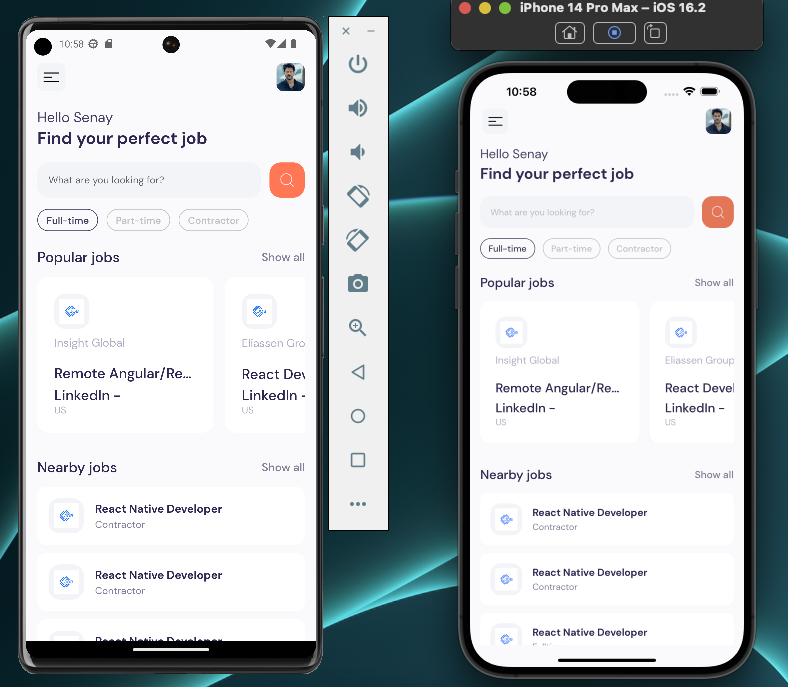

# Job Hunter App

## Introduction
The Job Hunter App is a mobile application built with React Native that allows users to search for job listings from various sources. The app utilizes the RapidAPI job search API to fetch data, and displays it in a user-friendly way.

checkout the website using your camera 
https://expo.dev/@sunny17/jobhunter?serviceType=classic&distribution=expo-go


## Features
* Search for job listings by title, location, and company
* Filter results by job type, salary range, and experience level
* Save favorite job listings for future reference
* Apply to job listings directly within the app
* Share job listings with friends and family

## Technologies Used
* React Native
* Expo
* RapidAPI
* Axios
* Redux
* React Navigation
* AsyncStorage

## Getting Started
To run the app on your local machine, follow these steps:

1. Clone the repository to your local machine
2. Install the Expo CLI by running `npm install -g expo-cli`
3. Install project dependencies by running `npm install`
4. Create a `.env` file in the root directory of the project and add your RapidAPI key:
   ```
   RAPIDAPI_KEY=<your-api-key-here>
   ```
5. Start the Expo server by running `expo start`
6. Open the Expo app on your mobile device, scan the QR code shown in the terminal, and wait for the app to load

## Deployment
To deploy the app to Expo, follow these steps:

1. Create an account on [Expo](https://expo.io/)
2. Install the Expo CLI by running `npm install -g expo-cli`
3. Build the app by running `expo build:android` or `expo build:ios`
4. Upload the build to Expo by running `expo upload:android` or `expo upload:ios`
5. Wait for the build to process and deploy to Expo

## Contributing
Contributions are welcome! If you want to contribute to the project, please follow these steps:

1. Fork the repository
2. Create a new branch for your changes
3. Make your changes and commit them to your branch
4. Push your branch to your forked repository
5. Submit a pull request to the main repository

## License
This project is licensed under the MIT License - see the [LICENSE](LICENSE) file for details.

## Acknowledgments
* [RapidAPI](https://rapidapi.com/marketplace) for providing the job search API
* [Expo](https://expo.io/) for providing a simple and fast way to deploy React Native apps
* The open source community for creating and maintaining the libraries and tools used in this project.